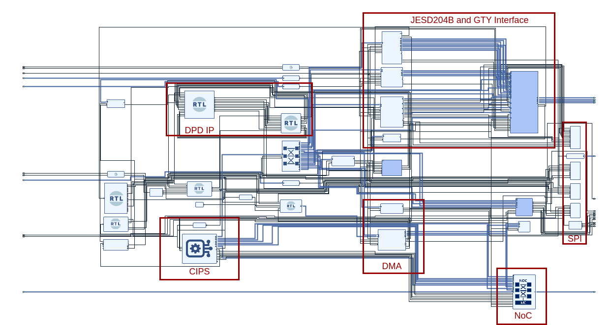

# The VCK190 Radio Frequency Platform for Digital Predistortion

## Overview
This platform is a microwave system platform built on the latest AMD Xilinx Versal series FPGA evaluation board VCK190.

The system include the following components:
- JESD204: To protocol to communicate with the data converters.
- SPI: To control the converter and clock chips.
- DMA: To move baseband data from DDR/ADC to DAC/DDR.
- CIPS: The PS side of Versal, act as the central control unit. For now, I only implement a baremetal design, but Petalinux version is on the way.
- NoC: Integrated with a DDR controller. The DMA and CIPS need to use NoC to get access to DDR.
- PRVTDNN: Neural network digital predistortion algorithm IP core. The IP core is implemented in Chisel, check [PRVTDNN](https://github.com/SEU-MSLab/PRVTDNN) for more information.



## Prerequisite
- AMD/Xilinx [VCK190](https://www.xilinx.com/products/boards-and-kits/vck190.html) evaluation board
- ADI [AD9173](https://www.analog.com/en/products/ad9173.html) analog-to-digital converter evaluation board
- ADI [AD6688](https://www.analog.com/en/products/ad6688.html) digital-to-analog converter evaluation board
- Linux machine with at least 32GB RAM
- Vivado 2023.1 (other versions are not tested)

## How to build
Make sure you have `source settings64.sh` in Vivado installation path and have `vivado` command in your environment.
```shell
git clone https://github.com/SEU-MSLab/vck190-platform.git
cd vck190-platform
make
```
